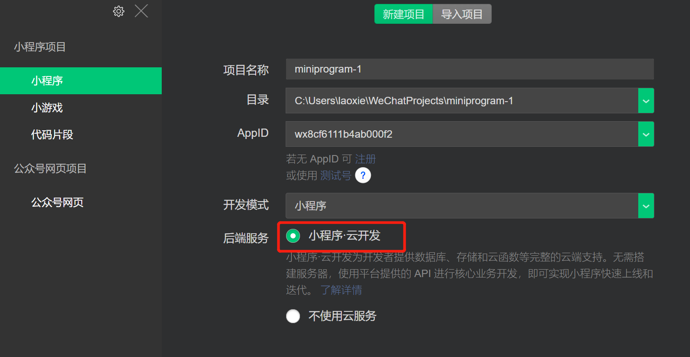
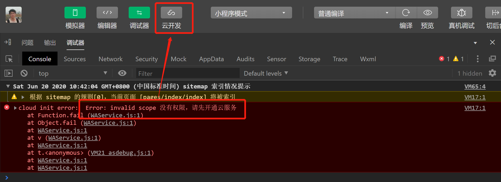

# 微信小程序云开发

开发者可以使用**云开发**来开发微信小程序、小游戏，而无需额外搭建服务器，即可使用数据库、云函数、存储空间等云端能力，使用平台提供的 API 进行核心业务开发，同时也可以使用自己的服务器协同开发

## 开通云开发

1. 建云开发模板


2. 开通云开发、创建环境
> 创建完项目，默认云开发为未开通状态，控制台会报以下错误


点击**云开发**按钮，选择开通云开发，然后填写**环境名称**并确认就完成了云开发功能的开通操作，默认为**基础版1**（免费），拥有以下资源配额：

- 存储空间：5G/月
- 数据库：2G
- 数据库集合数：20
- 云函数同时连接数：20
- CDN流量：5G/月
- 云函数调用次数：20W/月

更详细或更高的配额，请查看：https://developers.weixin.qq.com/miniprogram/dev/wxcloud/billing/quota.html


> PS：一个环境对应一整套独立的云开发资源（数据库、存储空间、云函数等）。各个环境是相互独立的，用户开通云开发后即创建了一个环境，默认一个小程序最多可拥有2个环境。在实际开发中，**建议每一个正式环境（release）都搭配一个测试环境（test）**


## 云开发能力

开通云开发功能后，可以利用微信小程序提供的相关API实现**数据库操作**、**文件存储**、**云函数调用**等操作，分**服务端**与**小程序端**，小程序端 API 拥有严格的调用权限控制，开发者可在小程序内直接调用 API 进行非敏感数据的操作，对于有更高安全要求的数据，建议在**云函数**内通过服务端 API 进行操作（**云函数的环境是与客户端完全隔离的**）

> SDK API文档: https://developers.weixin.qq.com/miniprogram/dev/wxcloud/reference-sdk-api/Cloud.html

### 初始化
在调用云开发 API 前，需先调用初始化方法 `init` 一次（全局只需一次，多次调用时只有第一次生效）

* 小程序端初始化
   > 建议在app.js中的onLaunch中进行初始化
   ```js
      // 可通过env属性指定云开发环境id
      wx.cloud.init({
         env:'qf-52690b'
      })
   ```

* 云函数端初始化
服务端无法直接调用`wx.xxx`接口，初始化需要使用微信提供的工具包`wx-server-sdk`来实现相应功能（创建云函数时的默认依赖）
   ```js
      const cloud = require('wx-server-sdk')
      cloud.init({
         // env:'qf-52690b',
         // DYNAMIC_CURRENT_ENV 指云函数当前所在的环境
         env: cloud.DYNAMIC_CURRENT_ENV
      })

   ```
   > PS: `wx-server-sdk` 是一个帮助我们在云函数中操作数据库、存储以及调用其他云函数的微信提供的库，与小程序端的云 API 以同样的风格提供了数据库、存储和云函数的 API


### 数据库操作

> 云开发中的数据库与Mongodb类似，可以在后台创建集合、新建、导入、导出数据等操作，也可以通过微信提供的api接口进行操作

#### 使用步骤如下：

1. 获取数据库实例

   ```js
      const db = wx.cloud.database()
      
      // 获取指定环境的数据库（如不指定则使用初始化时指定的环境）
      const db = wx.cloud.database({
         env:'qf-52690b',   
      })
   ```

2. 获取集合

   ```js
      const user = db.collection('user')
   ```

3. 数据的CRUD

   > 以下`Collection`为查询到的集合（如上面第2步的`user`）

   ```js
      // 增
      user.add(options)
      // 删
      user.remove()
      // 改
      user.update()
      // 查
      user.get()
      // 统计匹配的数量
      user.count()
   ```

4. 构建查询条件

   > 以上CRUD除了`add()`外，其它操作都必须先使用`where()`等方法构建查询条件，以下方案返回`Collection`

   * where()
   * limit()
   * orderBy()
   * skip()
   * field()

### 文件存储操作
云开发提供了一块存储空间，提供了上传文件到云端、带权限管理的云端下载能力，开发者可以在小程序端和云函数端通过 API（如：`wx.cloud.uploadFile` 和 `wx.cloud.downloadFile`）使用云存储功能
```js
   // 上传图片
   wx.chooseImage({
      success: chooseResult => {
         // 将图片上传至云存储空间
         wx.cloud.uploadFile({
            // 指定上传到的云路径
            cloudPath: 'my-photo.png',
            // 指定要上传的文件的小程序临时文件路径
            filePath: chooseResult.tempFilePaths[0],
            // 成功回调
            success: res => {
               console.log('上传成功', res)
            },
         })
      },
   })
```
> PS：接口文档：https://developers.weixin.qq.com/miniprogram/dev/wxcloud/guide/storage/api.html

### 云函数

云函数用来编辑后端代码，运行在NodeJS环境下，可直接使用npm模块，编写好的云函数可在**小程序端**调用，也可以在其它云函数中调用

> PS：在`project.config.json`中通过`cloudfunctionRoot`属性指定云函数目录，可在目录中创建、调试云函数，然后同步到云端使用

* 定义云函数
```js
   // 云函数入口函数
   exports.main = async (event, context) => {
      console.log('event=',event)
      console.log('context',context)
      return {
         sum: event.a + event.b
      }
   }
```

* 调用云函数
   >使用 `wx.cloud.callFunction()`调用定义好的云函数
   ```js
      wx.cloud.callFunction({
         name:'sum',
         data:{
            a:20,
            b:10
         },
         success(res){
            console.log('sum.res=',res.result);
         }
      })
   ```


#### 云调用
所谓云调用，是指允许在云函数中调用服务端开放接口：https://developers.weixin.qq.com/miniprogram/dev/api-backend/

### 外部服务器操作云开发能力
> 可通过自己的服务器操作云开发中的数据，详情请查看：https://developers.weixin.qq.com/miniprogram/dev/wxcloud/reference-http-api/


